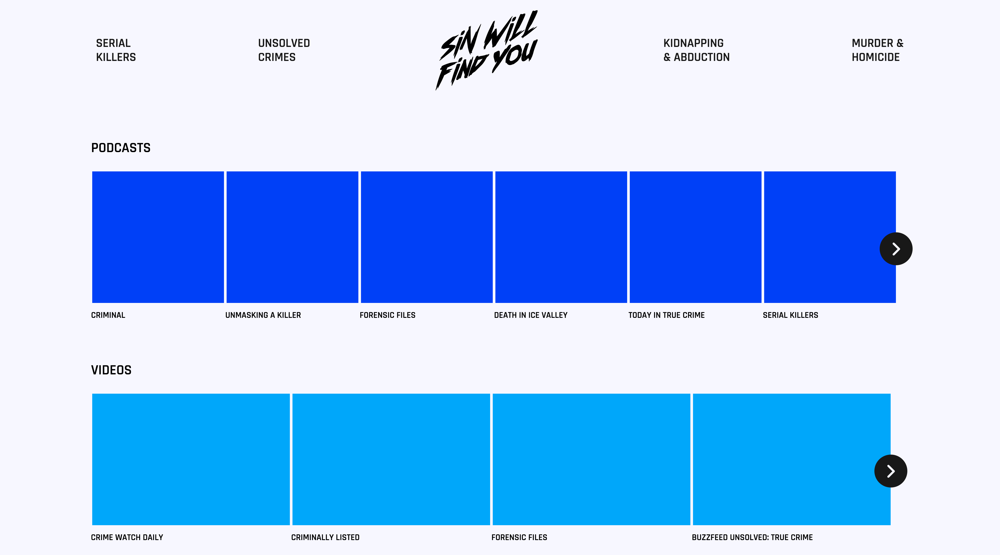

# Sin Will Find You
Sin Will Find You is a website that aggregates podcasts, youtube channels, other media relating specifically to true crime. It pulls data from multiple APIs, lets users sign in to save their favorites, and provides direct links to corresponding external  sites and apps.

### Why I decided to build this app
True crime is one of my favorite subgenres when it comes to entertainment. I wanted to create an app that would like users find various media pertaining to the subject without having to utilize several different services (i.e. using a podcast directory, going to YouTube, browsing hours on Reddit on an unrelated sub because that place is a rabbit hole).

### Technologies used
I opted to code this website using the NERDS stack (*NERDS!*):
* NodeJS (https://nodejs.org/en/)
* Express (https://expressjs.com/)
* ReactJS (https://reactjs.org/)
* Databases
   * using SQL (https://www.postgresql.org/)

The App
------

#### User Stories
1. Users should be able to get a comprehensive overview of podcasts, tv shows, films, and videos.
2. Users should be able to search for topics and receive results based on query.
