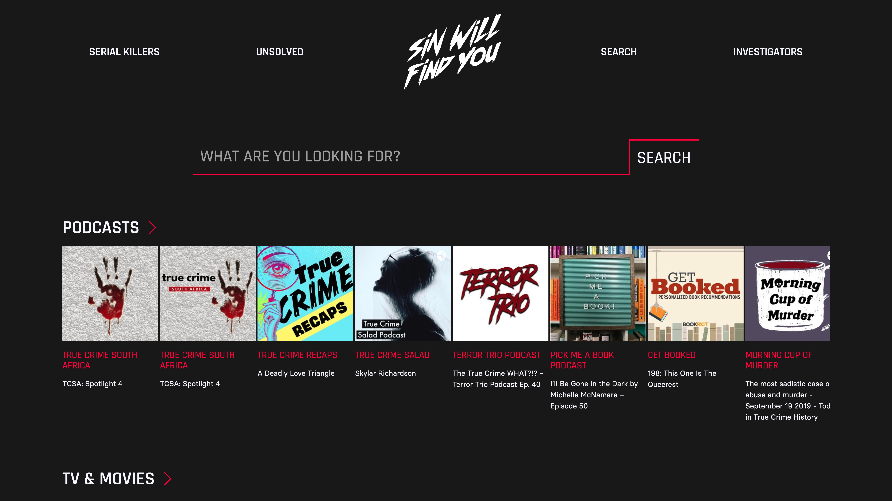

# Sin Will Find You
https://sinwillfindyou.herokuapp.com

Have you ever been at home alone late at night and you hear something, so you stop what you're doing until it's dead silent, just so you can try to hear whatever it was? There's a good chance it's just the ice maker, but what if it wasn't? What if it was something more sinister?

Sin Will Find You aggregates podcasts, YouTube videos, television shows, and movies from the world of true crime. It fetches and renders data from multiple APIs, provides direct links to corresponding external sites, and lets users "leave evidence behind" in the form of a guestbook — a throwback to websites of the early 2000s.

### Why I decided to build this app
I love true crime. It is easily one of my favorite genres. However, finding media relating to the subject often leads me downa  rabbit hole of other irrelevant topics. I wanted to create an app that pulls media from various sources together in one convenient service. No more searching through podcast directories... filtering out YouTube videos/channels... upvoting things you weren't even looking for on Reddit... etc.

#### User Stories
1. Users should be able to get a comprehensive overview of podcasts, tv shows, movies, and videos.
2. Users should be able to search for topics and receive results based on query.
3. Users should be able to click media and be taken to a website that provides more information about the result.
4. Users should not have to refresh the page to receive new results.
5. Users should be able to get results for serial killers and unsolved crimes with just one click (because popular genres).
6. ~~Users should be able to sign in to save their favorites.~~ Users should be able to sign a guestbook.

#### Where in the world ~~is Carmen Sandiego~~ did authentication go?
Originally, I planned to allow users to sign in to save their favorites. But I decided to scrap the idea based on the fact that clicking a result takes users to third party sites where they can then find, e.g. a podcast, using their favorite podcast app. Instead, I used the database for a guestbook feature. Users can leave their name, location, age, and notes, which are then provided as cards under the Evidence Log form.

### Technologies used
I opted to code this website using the NERDS stack. Why? Honestly, because it's called NERDS. (*NERDS!*):
* NodeJS (https://nodejs.org/en/)
* Express (https://expressjs.com/)
* ReactJS (https://reactjs.org/)
* Databases
   * using SQL (https://www.postgresql.org/)
